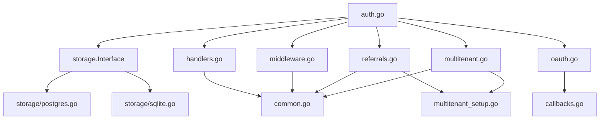

# 📁 Project Structure

This document provides a comprehensive overview of the Wispy Auth project structure, file organization, and component relationships.

## 🏗️ Root Directory Structure

```
wispy-auth/
├── 📚 docs/                    # Documentation files
├── 🗂️ example/                 # Example applications
│   ├── 🌐 app/                 # Complete web application
│   ├── 🔐 oauth/               # OAuth integration examples
│   ├── 🎯 referrals/          # Referral system demo
│   └── 🧪 testing/            # Testing patterns
├── 🗄️ migrations/             # Database schema files
├── 📦 storage/                 # Storage implementations
├── 📄 *.go                    # Core library files
├── 📖 README.md               # Main documentation
├── ⚙️ CLAUDE.md               # Development guidance
└── 🔧 go.mod                  # Go module definition
```

## 🔧 Core Library Files

### Primary Components

| File | Purpose | Key Features |
|------|---------|--------------|
| `auth.go` | Main service & configuration | AuthService, Config, SecurityConfig |
| `handlers.go` | HTTP request handlers | Structured responses, validation |
| `middleware.go` | Chi router middleware | Authentication, authorization |
| `storage.go` | Storage interface definitions | Interface contracts, type aliases |

### Feature Modules

| File | Purpose | Key Features |
|------|---------|--------------|
| `referrals.go` | Referral system | Role-based limits, code generation |
| `multitenant.go` | Multi-tenant types | Tenant, role, permission definitions |
| `multitenant_setup.go` | RBAC management | Tenant/role/permission CRUD |
| `oauth.go` | OAuth configurations | Provider definitions |
| `password_reset.go` | Password reset flow | Token generation, validation |
| `two_factor.go` | 2FA infrastructure | TOTP support, backup codes |
| `login_security.go` | Account security | Lockout, attempt tracking |

### Infrastructure Files

| File | Purpose | Key Features |
|------|---------|--------------|
| `common.go` | Shared utilities | Password validation, tokens, security events |
| `crypto.go` | Cryptographic functions | Secure token generation |
| `callbacks.go` | OAuth callback handling | State validation, user creation |

## 🗄️ Storage Layer

### Storage Implementations

```
storage/
├── storage.go      # Interface definitions & types
├── postgres.go     # PostgreSQL implementation
└── sqlite.go       # SQLite implementation
```

**Key Interfaces:**
- `Interface` - Main storage contract
- `User`, `Session`, `SecurityEvent` - Core types
- `ReferralCode`, `UserReferral` - Referral types
- `Tenant`, `Role`, `Permission` - Multi-tenant types

### Database Schema

```
migrations/
├── postgres_scaffold.sql    # PostgreSQL schema
└── sqlite_scaffold.sql      # SQLite schema
```

**Tables Created:**
- Core: `users`, `sessions`, `security_events`, `oauth_states`
- Multi-tenant: `tenants`, `roles`, `permissions`, `user_tenants`, `role_permissions`
- Referrals: `referral_codes`, `user_referrals`

## 🌐 Example Applications

### Complete Applications

| Directory | Purpose | Features Demonstrated |
|-----------|---------|----------------------|
| `example/app/` | Production-ready web app | Full auth flow, multi-tenant, email integration |
| `example/oauth/` | OAuth integration | Dynamic providers, enterprise SSO |
| `example/referrals/` | Referral system | Role-based limits, API management |
| `example/testing/` | Testing patterns | Mock services, in-memory storage |

### Example Structure

```
example/
├── app/
│   ├── main.go              # Application server
│   ├── services.go          # Email service implementation
│   ├── migrations/          # Database migrations
│   ├── go.mod              # Module dependencies
│   └── README.md           # Setup instructions
├── oauth/
│   ├── main.go              # OAuth demonstration
│   ├── go.mod              # Module dependencies
│   └── README.md           # OAuth examples
├── referrals/
│   ├── main.go              # Referral system demo
│   ├── go.mod              # Module dependencies
│   └── README.md           # Referral documentation
└── testing/
    ├── oauth_dynamic_demo.go # Testing examples
    ├── go.mod              # Module dependencies
    └── README.md           # Testing patterns
```

## 🔗 Component Dependencies

### Dependency Graph



### Import Relationships

**Main Dependencies:**
- `auth.go` imports all feature modules
- Feature modules import `common.go` for utilities
- Storage implementations implement `storage.Interface`
- Examples import the main library

**External Dependencies:**
- `github.com/go-chi/chi/v5` - HTTP routing
- `github.com/go-playground/validator/v10` - Input validation
- `golang.org/x/crypto/bcrypt` - Password hashing
- `golang.org/x/oauth2` - OAuth2 implementation
- Database drivers (PostgreSQL/SQLite)

## 🎯 Key Design Patterns

### 1. Interface-Based Architecture

```go
// Storage layer abstraction
type Interface interface {
    CreateUser(*User) error
    GetUserByEmail(string, string) (*User, error)
    // ... other methods
}

// Email service abstraction
type EmailService interface {
    SendVerificationEmail(string, string) error
    SendPasswordResetEmail(string, string) error
    SendWelcomeEmail(string, string) error
}
```

### 2. Structured Response Pattern

```go
// All handlers return structured responses
type SignUpResponse struct {
    Token                     string `json:"token"`
    User                      *User  `json:"user"`
    RequiresEmailVerification bool   `json:"requires_email_verification"`
    StatusCode                int    `json:"-"`
    Error                     string `json:"error,omitempty"`
}
```

### 3. Configuration-Driven Design

```go
// Comprehensive configuration
type Config struct {
    DatabaseDSN     string
    Storage         storage.Interface
    EmailService    EmailService
    SecurityConfig  SecurityConfig
    StorageConfig   StorageConfig
    OAuthProviders  map[string]OAuthProviderConfig
}
```

### 4. Multi-Tenant Context

```go
// Context-based user/tenant access
user := auth.MustGetUserFromContext(ctx)
tenant := auth.MustGetTenantFromContext(ctx)
```

## 🔒 Security Architecture

### Security Layers

1. **Input Validation** - All handlers validate input using struct tags
2. **Authentication** - Session-based with device fingerprinting
3. **Authorization** - Role-based access control per tenant
4. **Audit Logging** - Comprehensive security event tracking
5. **SQL Protection** - Prepared statements throughout

### Security Features by Component

| Component | Security Features |
|-----------|------------------|
| `auth.go` | Password hashing, session management |
| `handlers.go` | Input validation, structured error handling |
| `middleware.go` | Authentication, authorization, tenant isolation |
| `login_security.go` | Brute force protection, account lockout |
| `common.go` | Secure token generation, password validation |

## 📈 Performance Considerations

### Optimizations

1. **Pure SQL** - No ORM overhead, direct database queries
2. **Prepared Statements** - All queries use prepared statements
3. **Connection Pooling** - Built-in PostgreSQL connection pooling
4. **Minimal Allocations** - Struct-based responses, efficient memory usage
5. **Selective Loading** - Only load required data for operations

### Scalability Features

- Multi-tenant data isolation
- Configurable table/column mappings
- Pluggable storage backends
- Stateless session management
- Horizontal scaling ready

## 🧪 Testing Strategy

### Test Organization

```
example/testing/
├── oauth_dynamic_demo.go    # OAuth testing patterns
├── mock_services.go         # Mock implementations
└── integration_tests.go     # Integration test examples
```

### Testing Patterns

1. **In-Memory Storage** - SQLite for isolated tests
2. **Mock Services** - Email service mocking
3. **Configuration Testing** - Validation testing
4. **Integration Tests** - End-to-end flow testing

## 🚀 Deployment Structure

### Production Layout

```
production/
├── app/                     # Your application
├── migrations/              # Database schema
├── config/                  # Configuration files
├── docker/                  # Container definitions
└── scripts/                 # Deployment scripts
```

### Configuration Management

- Environment variables for secrets
- Configuration structs for settings
- Multiple storage backend support
- Email service integration points

This structure provides a solid foundation for building secure, scalable authentication systems with comprehensive feature sets.